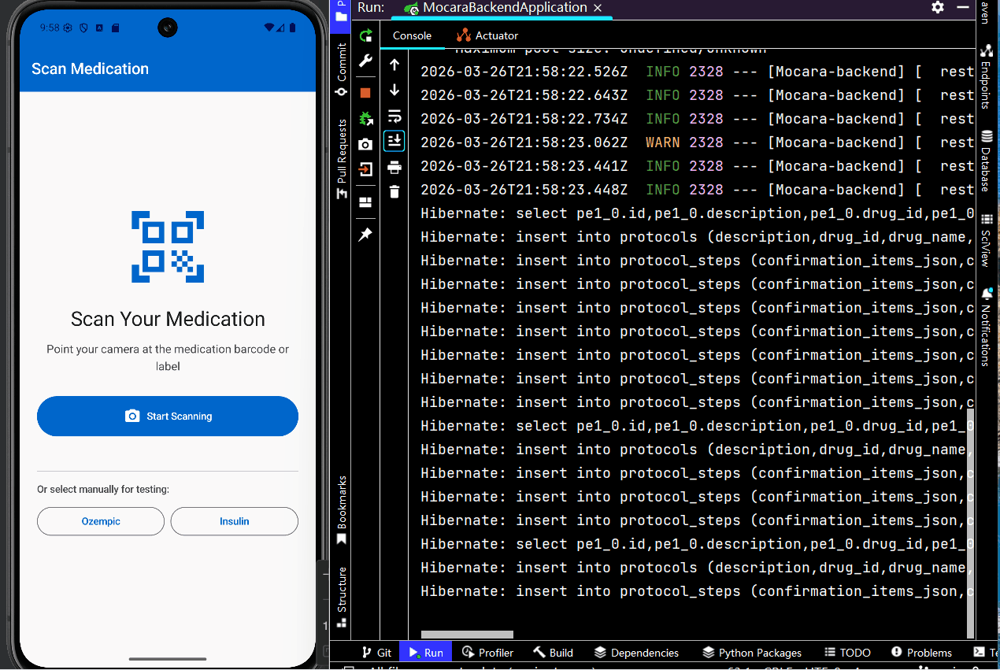

## Mocara AI Medication Onboarding System

A full-stack healthcare onboarding system integrating an Android client with a Spring Boot backend.
The platform guides patients through structured medication protocols while supporting interactive chat assistance and escalation detection for safety-critical scenarios.

This project demonstrates full-stack system design, combining mobile application architecture, backend API design, database modeling, and domain-driven backend structure.

## System Architecture
The system consists of two primary components:

- Android Client – Patient-facing mobile application
- Spring Boot Backend – API layer and business logic
- PostgreSQL Database – Persistent storage
```text
                   ┌──────────────────────────┐
                   │        Android App       │
                   │  Kotlin + JetpackCompose │
                   │                          │
                   │  UI Layer                │
                   │  ViewModel (StateFlow)  │
                   │  Repository              │
                   │  Retrofit API Client     │
                   └─────────────┬────────────┘
                                 │
                                 │ HTTPS REST API
                                 ▼
                ┌──────────────────────────────────┐
                │        Spring Boot Backend       │
                │                                  │
                │  Controller Layer (REST API)     │
                │                                  │
                │  ChatController                  │
                │  ProtocolController              │
                │  SessionController               │
                │  EscalationController            │
                │                                  │
                │  Service Layer                   │
                │                                  │
                │  ChatService                     │
                │  ProtocolService                 │
                │  SessionService                  │
                │                                  │
                │  Domain Modules                  │
                │  Chat / Protocol / Session       │
                │                                  │
                │  Persistence Layer               │
                │  Spring Data JPA Repositories    │
                └───────────────┬──────────────────┘
                                │
                                ▼
                       ┌────────────────┐
                       │   PostgreSQL   │
                       │                │
                       │  sessions      │
                       │  protocol      │
                       │  protocol_step │
                       │  chat_message  │
                       │  escalation    │
                       └────────────────┘

```
## Authentication & Security

This project now includes a production-oriented JWT authentication system across backend and Android client.

### Security Goals

- Stateless authentication for scalable APIs
- Short-lived access tokens + long-lived refresh tokens
- Server-side refresh token control (rotation + revocation)
- Safe client logout and automatic local sign-out on auth failure
- Role-aware authorization and ownership checks

### Backend Implementation (Spring Boot)

#### Core stack
- Spring Security (`SecurityFilterChain`, stateless)
- JWT (signed tokens with claims)
- BCrypt password hashing
- Flyway-managed auth schema

#### Auth endpoints
- `POST /api/v1/auth/register`
- `POST /api/v1/auth/login`
- `POST /api/v1/auth/refresh`
- `POST /api/v1/auth/logout`

#### JWT model
- **Access token**: short-lived, used for API authorization
- **Refresh token**: long-lived, used only for token renewal
- Claims include:
    - `userId`
    - `roles`
    - `type` (`access` / `refresh`)

#### Refresh token security
- Refresh tokens are stored as **SHA-256 hashes** (not plaintext)
- **Rotation on refresh**:
    - old refresh token is revoked
    - a new refresh token is issued
- Reuse detection logic is included to reduce replay risk
- Logout revokes the submitted refresh token server-side

#### Authorization rules
- Protected API domains require authenticated JWT
- Role-based guard supports `USER` / `ADMIN`
- Ownership checks enforce:
    - `USER`: access own session data
    - `ADMIN`: access all sessions

#### Security handling
- `401 Unauthorized` for unauthenticated requests
- `403 Forbidden` for authenticated but unauthorized requests
- Error responses avoid leaking sensitive internals
- CORS configured for mobile API consumption

#### Rate limiting
- Login/register are protected by request throttling to reduce brute-force attacks
- Current implementation is in-app (good baseline)
- Recommended production upgrade: move rate limiting to Redis or API gateway

### Android Implementation (Compose + MVVM)

#### Token management
- Tokens stored via DataStore-backed `TokenManager`
- Supported operations:
    - `getAccessToken()`
    - `getRefreshToken()`
    - `saveTokens()`
    - `clearTokens()`

#### Networking security
- OkHttp interceptor attaches `Authorization: Bearer <accessToken>`
- Authenticator handles `401` by calling refresh API and retrying original request
- Infinite retry loops are prevented with retry guards
- If refresh fails, local tokens are cleared to force safe sign-out

#### Auth flow
- On app launch:
    - token exists -> enter authenticated flow (scanner)
    - no token -> navigate to login
- Logout flow:
    - calls backend `/auth/logout` with refresh token (if present)
    - always clears local tokens
    - navigates to login and clears authenticated back stack

### Why this design is safer

- **JWT + stateless API** improves horizontal scalability
- **Hashed refresh token storage** limits impact of DB leaks
- **Refresh rotation** reduces replay window for stolen tokens
- **Server-side logout revocation** prevents refresh reuse after sign-out
- **Token-clearing fallback on client** avoids half-signed-in inconsistent state

### Configuration

Set JWT secret from environment variable (required):

### PowerShell
$env:JWT_SECRET="your-strong-secret-at-least-32-bytes"
```bash
app:
  security:
    jwt:
      secret: ${JWT_SECRET}
 ```

## Backend Architecture

The backend follows a domain-modular architecture, where each domain encapsulates its own entities, repositories, and services.
```text
backend
 ├── api
 │   ├── controller
 │   └── dto
 │
 ├── chat
 │   ├── entity
 │   ├── mapper
 │   ├── repo
 │   └── service
 │
 ├── protocol
 │   ├── entity
 │   ├── mapper
 │   ├── repo
 │   └── service
 │
 ├── session
 │   ├── entity
 │   ├── mapper
 │   ├── repo
 │   └── service
 │
 └── common
     ├── enums
     └── config

```
Benefits of this architecture:

- Clear separation of business domains
- Easier scalability for new features
- Improved maintainability of backend services
## Android Architecture

The Android application follows Clean Architecture with MVVM.
```text
UI (Jetpack Compose)
        │
        ▼
ViewModel
        │
        ▼
Domain Layer
        │
        ▼
Repository
        │
        ▼
Retrofit API Client

```
This design ensures separation of concerns and testable application logic.
## Database Design

The backend models a structured medication onboarding workflow.
### protocol

Defines a medication onboarding protocol.
```text
| Column      | Description               |
| ----------- | ------------------------- |
| id          | step identifier           |
| protocol_id | associated protocol       |
| step_order  | step sequence             |
| step_type   | INFO / QUESTION / CONFIRM |
| content     | step content              |

```

### patient_session

Represents a patient's onboarding session.
```text
| Column       | Description                    |
| ------------ | ------------------------------ |
| id           | session id                     |
| protocol_id  | associated protocol            |
| patient_id   | patient identifier             |
| current_step | current step index             |
| status       | ACTIVE / COMPLETED / ESCALATED |
| created_at   | session creation               |

```
### session_response

Stores patient responses for each protocol step.
```text
| Column     | Description        |
| ---------- | ------------------ |
| id         | response id        |
| session_id | associated session |
| step_id    | protocol step      |
| response   | patient response   |
| created_at | timestamp          |

```
### chat_message

Stores chat interaction messages.
```text
| Column     | Description           |
| ---------- | --------------------- |
| id         | message id            |
| session_id | session reference     |
| sender     | PATIENT / AI / SYSTEM |
| message    | chat content          |
| timestamp  | message time          |

```
### escalation

Represents detected safety escalation events.
```text
| Column     | Description                    |
| ---------- | ------------------------------ |
| id         | escalation id                  |
| session_id | session reference              |
| level      | LOW / MEDIUM / HIGH / CRITICAL |
| reason     | escalation reason              |
| created_at | timestamp                      |

```

## Key Features
### Medication Onboarding Workflow
Patients are guided through structured medication protocols step by step.
### Session Management
Patient sessions track progress across onboarding steps.
### Chat Interaction
Patients can interact with a chat interface during onboarding.
### Escalation Detection
Potential safety risks trigger escalation events for further review.
## Technology Stack
### Backend
- Java 21
- Spring Boot
- Spring Data JPA
- PostgreSQL
- Flyway database migration
### Mobile
- Kotlin
- Jetpack Compose
- MVVM Architecture
- Retrofit REST client
##  Running the Backend
### Clone the repository
```bash
git clone https://github.com/Mingyueoo/mocara-ai-onboarding-system.git
cd mocara-backend
```
### Configure database
Update `application.yaml`
```yaml
spring:
  datasource:
    url: jdbc:postgresql://localhost:5432/mocara
    username: postgres
    password: password
```
### Start the backend
```bash
mvn spring-boot:run
```
## Example API
### Create a new session
```bash
POST /api/v1/sessions
```
Request
```json
{
  "protocolId": 1,
  "patientId": "12345"
}
```
Response
```json
{
  "sessionId": 12,
  "status": "ACTIVE"
}
```
### Send chat message
```bash
POST /api/v1/chat
```
Request
```json
{
  "sessionId": 12,
  "message": "I feel dizzy after taking this medication"
}
```
## Future Improvements
Potential extensions include:
- AI-powered medical chat assistant
- Docker deployment
- API documentation with OpenAPI / Swagger
- Event-driven architecture for escalation alerts
## Engineering Highlights
- Designed a modular backend architecture separating Chat, Protocol, and Session domains.
- Implemented RESTful APIs supporting onboarding workflows, chat interactions, and escalation detection.
- Modeled healthcare workflows with relational database schema design.
- Integrated Android client with backend services via Retrofit REST APIs.
- Built persistence layer using Spring Data JPA with entity-DTO mapping.
- Implemented database migrations using Flyway for consistent schema management.